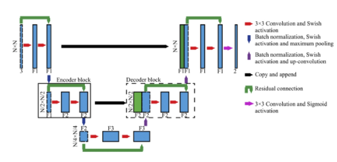
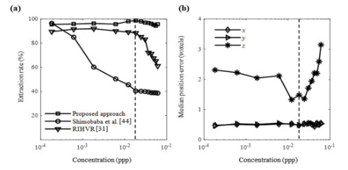
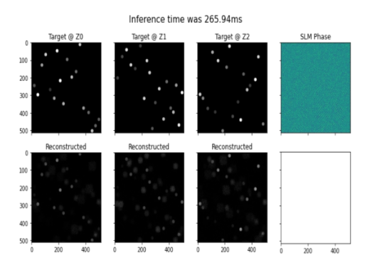

# Exploratory_Project
Code and Notebook for Exploratory project titled 'DEEP LEARNING HOLOGRAPHY'. Details are given in this [Report](https://drive.google.com/file/d/1DP8gqTp4nIWsrC5RUJ4u1DtLd4eL6h0K/view?usp=drive_link).  This is the repository that helps in the reproduction of the plots given in the report. The main aim of this report is that due to challenges arising in particle holograms, accurate measurement of individual particles is crucial. There were some methods that were developed earlier for the computational imaging tasks for the significant improvement in the particle extraction rate, localization accuracy, and speed compared to prior methods over a wide range of particle concentrations, including highly dense concentrations but those methods were found to be unsuitable. So in order to cope with those challenges discover a new learning-based approach that can potentially improve our computational imaging tasks or it could be extended to the other types of computational imaging tasks with similar features. For the 3D particle field imaging using holography demonstrate them with synthetic and experimental holograms. The main libraries used here are Numpy, Tensorflow, and DeepCGH which is an unsupervised, non-iterative algorithm for computer-generated holography. DeepCGH relies on convolutional neural networks to perform image plane holography in real time. A few of the plots and results are shown below. Use the notebook provided to get them.

 U-Net Architecture is used to incorporate residual connections where accurate measurement of individual particles is crucial

 Comparison of prediction results with a 100-particle h extraction rate of 97.0% (both false positive and false negative rates of 3.0%) while the highest concentration case has a 95.0% extraction rate (false positive rate of 1.6% and false negative rate of 5.0%)
(a) A 128×128-pixel enhanced hologram from the experimental data and corresponding volumetric image through the stacking of fluorescent bright field scanning of the same sample for determining the ground truth (b). (c). Prediction results in comparison with the ground truth. The gray dots correspond to ground truth and red crosses are extracted particles.

 Few results of target and reconstructed holograms and different values of Z.

